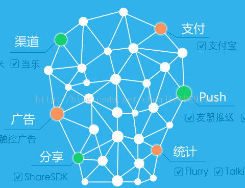

# 初见用户支付系统 CJSDK

## 设计思想
总体的设计思想是：参见[U8SDK——SDK接入抽象层的设计](http://c80.com.cn/archives/121)

1. 游戏各个渠道有一个主渠道SDK，比如UC，当乐，91等SDK。这个各个渠道只能同时有一个。不可能同时为UC也是91SDK

2. 非渠道的功能性SDK，包括广告，分享，统计，推送等。这些东西，我们作为插件集成到这套抽象框架来。

3. 所有SDK的实现可以很方便，而且结构比较统一

4. 所有的渠道SDK也好，还是功能性SDK也好，SDK抽象层都抽象出对应的接口。方便游戏层的调用，也方便具体插件的实现。

5. 考虑适应海外市场多种等资源，支持等资源包切换打包

## firstmeet-andsdk-ups-framework       
### 介绍
    CJSDK 初见用户支付系统（User Payment System）SDK框架, 一套框架适用于国内、海外游戏接入
	
	渠道统一框架接口，所有渠道必须实现本框架接口，统一游戏app接入方式

  > 唯一入口类： CJSDK    
	

### 功能清单
- 用户登录、帐号注册、快速注册、忘记密码、修改密码、修改个人信息（如绑定电邮地址）等用户账号相关功能
- facebook、google、wechat、twitter等第三方登录
- 上报各种事件日志

### 依赖
  > 依赖使用firstmeet-andsdk-mta-framework上报埋点数据

## UPS SDK实现渠道清单
编号|工程名称|说明
---|:---|---
1| firstmeet-andsdk-ups-chujian |       初见渠道用户支付系统SDK实现 CJSDK框架
2| firstmeet-andsdk-ups-huawei  |       huawei渠道用户支付系统SDK实现 CJSDK框架
3| firstmeet-andsdk-ups-vivo |          Vivo渠道用户支付系统SDK实现 CJSDK框架
4| firstmeet-andsdk-ups-oppo |          Oppo渠道用户支付系统SDK实现 CJSDK框架
5| firstmeet-andsdk-ups-uc   |          uc渠道用户支付系统SDK实现 CJSDK框架
6| firstmeet-andsdk-ups-xiaomi |        xiaomi渠道用户支付系统SDK实现 CJSDK框架
7| firstmeet-andsdk-ups-baidu  |        baidu渠道用户支付系统SDK实现 CJSDK框架
8| firstmeet-andsdk-ups-google  |       google渠道用户支付系统SDK实现 CJSDK框架

## UPS SDK资源包清单
编号|工程名称|说明
---|:---|---
0| firstmeet-andsdk-ups-langpack-zh_CN |    用户支付系统SDK图片、简体中文等资源包，默认
1| firstmeet-andsdk-ups-langpack-zh_TW |    用户支付系统SDK图片、繁体中文等资源包
2| firstmeet-andsdk-ups-langpack-th_TH |    用户支付系统SDK图片、泰文等资源包
3| firstmeet-andsdk-ups-langpack-ja_JP  |   用户支付系统SDK图片、日文等资源包
4| firstmeet-andsdk-ups-langpack-ko_KR  |   用户支付系统SDK图片、韩文等资源包
5| firstmeet-andsdk-ups-langpack-en_US  |   用户支付系统SDK图片、英文等资源包

# 初见移动跟踪分析MTA SDK （Mobile Tracking Analytics）
[参考：从U8SDK的设计之初，我们就已经考虑到了，其实作为一款统一的SDK接入框架，我们要接入的不仅仅是渠道SDK，还有很多和游戏功能相关的一些其他SDK，比如统计类SDK，广告SDK，分享SDK，推送SDK，调试SDK等。所以，基于U8SDK去接入这些功能性SDK是轻而易举的事情。下面我们就来以接入腾讯Bugly调试插件为例子，看看在U8SDK怎么接入功能性SDK。通过腾讯Bugly我们可以收集游戏的崩溃日志，以及其他一些游戏的性能监控等。和之前接入渠道SDK一样，我们也新建一个工程：U8SDK_Plugin_Bugly，将其IsLibrary选中。接入的过程也和渠道SDK一样，我们需要一个config.xml和一个SDKManifest.xml 。](http://c80.com.cn/archives/233)

## firstmeet-andsdk-mta-framework       
    MtaFramework 初见MTA SDK框架
	
	MTA统一框架接口，封装第三方事件、日志上报SDK,提供统一接口

## 功能清单
- app激活事件、app激活成功事件、用户登录事件、帐号注册事件、快速注册事件等采集与上报

## 封装实现MTA SDK清单
编号|工程名称|说明
---|:---|---
1| firstmeet-andsdk-mta-chujian |       初见MTA SDK实现 MtaFramework
2| firstmeet-andsdk-mta-toutiao  |      今日头条跟踪SDK实现封装 MtaFramework
3| firstmeet-andsdk-mta-qq  |           腾讯移动分析SDK实现封装 MtaFramework

## 参考资料
- [iOS 游戏渠道SDK 抽象工程封装](https://blog.csdn.net/SeanHuang1661/article/details/50131469)
- [U8SDK IOS游戏接入指南](http://www.6xsdk.com/u8-wiki/#!ios_game_doc.md)
- [Spotify iOS SDK ](https://github.com/spotify/ios-sdk)
- [TypeSdk手游聚合SDK](http://www.typesdk.com/)
- [Android Architecture Components 只看这一篇就够了](https://juejin.im/post/5b30e39bf265da599423510a)